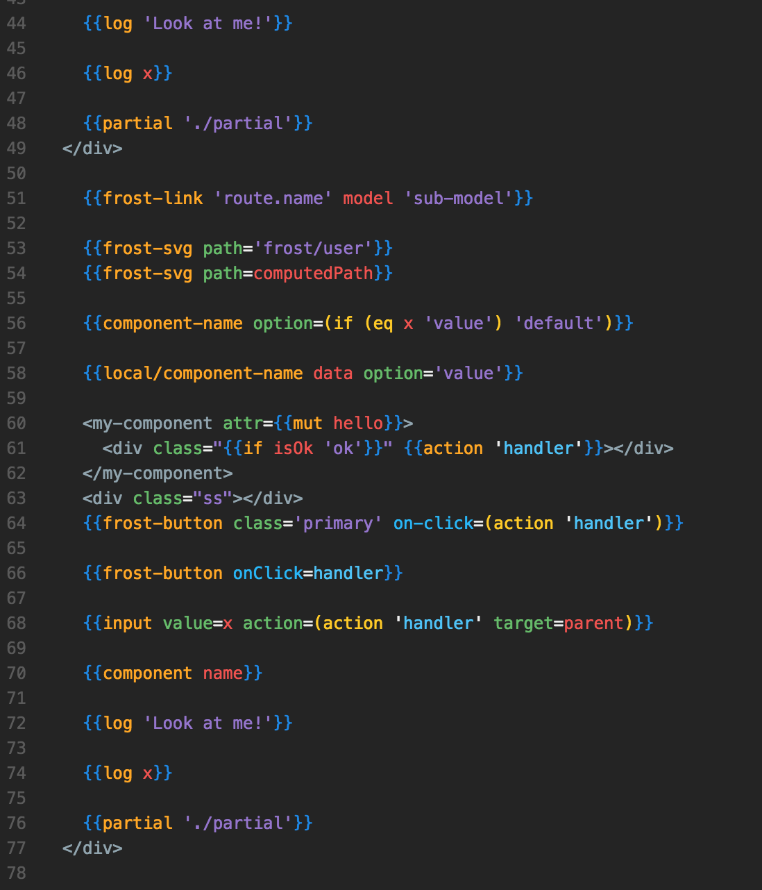

# ember-frost-syntax theme

A short description of your theme.

## Usage
Change syntax theme to Atom Ember Frost

## Theme:
* Handlebars:
	* 
	* 

## Notes:
Be sure to download a Babel package that handles grammar for a good Ember-Atom experience
